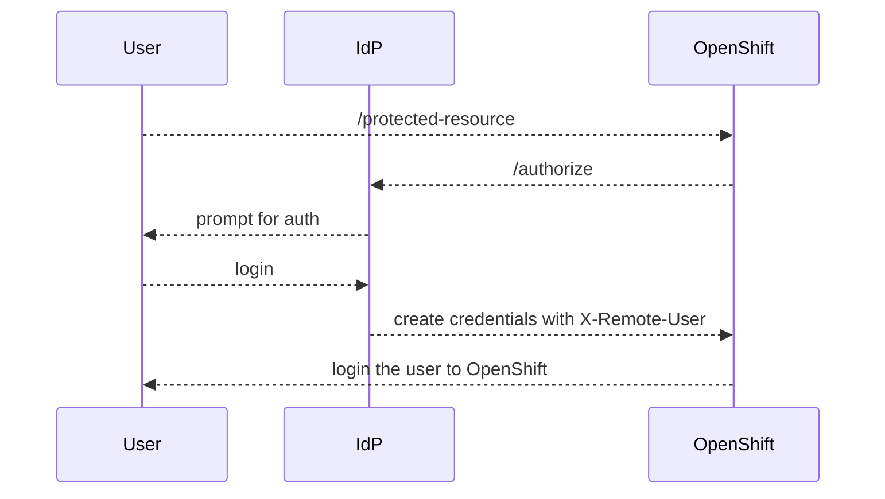

# **Proof-of-Concept** OpenShift RequestHeader Identity Provider with a Test IdP

**Special credit is given to [Stanislav Láznička](https://github.com/stlaz/openshift-requestheader-config) for the very helpful work and repository.

THIS IS TEST CODE ONLY AND IS NOT SUPPORTED

[OpenShift 4.10: Configuring a request header identity provider](https://docs.openshift.com/container-platform/4.10/authentication/identity_providers/configuring-request-header-identity-provider.html) enables an external service to act as an identity provider where a `X-Remote-User` header to identify the user's identity.

This document outlines the flow using the haproxy and Apache Httpd already installed on the Bastion server as part of the [installation process](https://github.com/ocp-power-automation/ocp4-upi-powervs/tree/release-4.10/docs) and a local Go Test IdP to demonstrate the feature. 

The rough flow between OpenShift, the User and the Test IdP is: 



## Steps

1. Install OpenShift 4.10 or a 4.11 Build on [Power Systems Virtual Server](https://cloud.ibm.com/catalog/services/power-systems-virtual-server)

2. Create the Certificates for localhost.com

**input**
```
bash create-certs.sh localhost.com
```

**output**
```
Generating a 4096 bit RSA private key
.++
.........++
writing new private key to 'ca.key'
-----
mtls - certs are being generated and signed
Generating a 4096 bit RSA private key
....................................................++
........++
writing new private key to 'client.key'
-----
Signature ok
subject=/C=US/O=IBM Corporation/OU=Power Systems/OU=OCP/CN=*.localhost.com
Getting CA Private Key
        Subject: C=US, O=IBM Corporation, OU=Power Systems, OU=OCP, CN=*.localhost.com
```

3. On your workstation, edit the /etc/hosts file and add a line so local resolution works:

**input**

```
sudo vim /etc/hosts
```

**output**

```
127.0.0.1 console-openshift-console.apps.ocp-test-de8b.111.111.111.111.xip.io oauth-openshift.apps.ocp-test-de8b.111.111.111.111.xip.io api.ocp-test-de8b.111.111.111.111.xip.io
```

5. Login to your bastion server with port forwarding:

``` sh
sudo ssh -L443:localhost:443 -L6443:localhost:6443 -L8443:localhost:8443 -i data/pvs_rsa <<user_id>>@<<bastion_ip>>
```

The use of sudo faciliates using a port under 1024. 
The `-i` enables logging in with the private key. 
The `<<user_id>>` is the user to connect to the bastion server. 
The `<<bastion_ip>>` is the ip you use to access the bastion host.

5. On your workstation, open a brower, and navigate to [console-openshift-console.apps.ocp-test-de8b.111.111.111.111.xip.io](https://console-openshift-console.apps.ocp-test-de8b.111.111.111.111.xip.io).  If you are prompted to accept SSL certificates, go right ahead.

6. Login with the kubeadmin credentials.

7. Click Administration > Click Cluster Settings

8. Click Configuration

9. Click on the **OAuth** entry

10. Click Add > Request Header

11. Enter the following details: 

|Name|Value|
|----|---|
|Name|requestHeaderIdp|
|URLs > Challenge URL | `http://localhost:8080/challenges/oauth/authorize?${query}` |
|URLs > Login URL | `http://localhost:8080/web-login/oauth/authorize?${query}` |
|CA File| Upload the ca.crt file|
|Headers| `X-Remote-User` |

12. Click Add. You'll see the requestHeaderIdp listed.

11. Copy the `dummy_idp/tmp/ca.crt`, `dummy_idp/tmp/client.crt` and `dummy_idp/tmp/client.key` over to the settings folder. On Linux you can use htpasswd and `htpasswd -nbBC 10 averdu <<pass>>`. 

12. Update the setings.json with your desired test users and bcryted has passwords.

13. Update your backend URL for your OAuth server.

14. Startup your local project (which is intentionally not wrapped or built as this is a demo only)

`go run main.go settings.go rest.go`

**Web Login** 

7. Open a private window, Navigate to the console 

8. Select the `requestHeaderIdp`

9. When prompted, login with one of the user's in setting and the bcrypt hash of the user's password. 

10. You should see the dashboard. 

**Challenge** 

1. Launch from the commandline: 

```
oc login https://api.ocp-test-de8b.111.111.111.111.xip.io:6443 -u testuser2b

Username: testuser2b
Password: 
Login successful.
```

2. You will be prompted for a userid and password. Enter the userid and password.

# Summary

You've seen a simple test IDP working with OpenShift.

Note, in the steps above, we did not remove the `kubeadmin` user to further secure the environment. You can find out more details at [link](https://docs.openshift.com/container-platform/4.10/authentication/understanding-identity-provider.html#removing-kubeadmin_understanding-identity-provider).

# References

- **OpenShift Identity Providers**
    - [OpenShift: Understanding identity provider configuration](https://docs.openshift.com/container-platform/4.10/authentication/understanding-identity-provider.html)
    - [OpenShift: Configuring a request header identity provider](https://docs.openshift.com/container-platform/4.10/authentication/identity_providers/configuring-request-header-identity-provider.html)
    - [OpenShift RequestHeader identity provider](https://github.com/stlaz/openshift-requestheader-config) - A proof-of-concept repository demonstrating a forward proxy
- **Htpasswd**
    - [StackOverflow: How to automate generation of htpasswd from command line without typing password?](https://stackoverflow.com/a/52663004/1873438)
