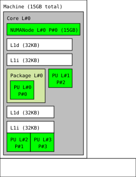

# Feature: Topology Manager

[Topology Manager](https://docs.openshift.com/container-platform/4.10/scalability_and_performance/using-topology-manager.html) coordinates Pod admission on the Node using hints from *kubelet* components to optimize workload performance. The Topology Manager collects Hints from kubelet components on a pod-by-pod or a container-by-container basis. These Topology Hints are generated from the *spec.containers.resources* and *spec.initContainers.resources* requests key-values and limits key-values. If the generated Topology Hints are not compatible with the Node, the Pod may be rejected.

Included in this document are supporting use-cases to see how the feature works on the IBM Power Systems hardware, and details on supporting references and utilities. 

# Use Cases

**`<`To Be Added`>`**

# References
The following are useful references related to the Topology Manager. 

- [borball/k8s-tm-test](https://github.com/borball/k8s-tm-test) for great examples. 
- **OpenShift**
    - [OpenShift 4.10: Using the Topology Manager](https://docs.openshift.com/container-platform/4.10/scalability_and_performance/using-topology-manager.html)
    - [OpenShift 4.10: Using device plug-ins to access external resources with pods](https://docs.openshift.com/container-platform/4.10/nodes/pods/nodes-pods-plugins.html)
    - [OpenShift 4.10: Using Device Manager to make devices available to nodes](https://docs.openshift.com/container-platform/4.10/nodes/pods/nodes-pods-plugins.html) Device Manager
    - [OpenShift 4.10: About Single Root I/O Virtualization (SR-IOV) hardware networks](https://docs.openshift.com/container-platform/4.10/networking/hardware_networks/about-sriov.html) -- Device Manager
    - [OpenShift Container Platform 4.10: Adding a pod to an SR-IOV additional network](https://docs.openshift.com/container-platform/4.10/networking/hardware_networks/add-pod.html)
    - [OpenShift 4.10: Using CPU Manager](https://docs.openshift.com/container-platform/4.10/scalability_and_performance/using-cpu-manager.html#using-cpu-manager) CPU Manager
    - [OpenShift Container Platform 4.10: Creating a performance profile](https://docs.openshift.com/container-platform/4.10/scalability_and_performance/cnf-create-performance-profiles.html)
    - [OpenShift 4.10: Performance Addon Operator for low latency nodes](https://docs.openshift.com/container-platform/4.10/scalability_and_performance/cnf-performance-addon-operator-for-low-latency-nodes.html)

- **Red Hat Articles**
    - [Red Hat Topology Aware Scheduling in Kubernetes Part 1: The High Level Business Case](https://cloud.redhat.com/blog/topology-aware-scheduling-in-kubernetes-part-1-the-high-level-business-case)
    - [Red Hat Topology Awareness in Kubernetes Part 2: Don't we already have a Topology Manager?](https://cloud.redhat.com/blog/topology-awareness-in-kubernetes-part-2-dont-we-already-have-a-topology-manager)
    - [Red Hat Customer Portal: NUMA-aware scheduling with NUMA Resources Operator](https://access.redhat.com/articles/6765511)
    - [Red Hat Enterprise Linux Performance Tuning Guide](https://access.redhat.com/documentation/en-us/red_hat_enterprise_linux/7/pdf/performance_tuning_guide/red_hat_enterprise_linux-7-performance_tuning_guide-en-us.pdf)
    - [Red Hat Customer Portal: [RHEL] How do I check for hugepages usage and what is using it?](https://access.redhat.com/solutions/320303)
    - The Linux Kernel: [What is NUMA?](https://www.kernel.org/doc/html/v4.18/vm/numa.html)

- ***PowerVS***
    - [IBM Cloud: PowerVS Machine Details](https://cloud.ibm.com/docs/power-iaas?topic=power-iaas-about-virtual-server)
    - Machine Details
        - [IBM RedBook: IBM Power E1080 Technical Overview and Introduction](https://www.redbooks.ibm.com/abstracts/redp5649.html)
        - [IBM RedBook: IBM Power System E980: Technical Overview and Introduction](https://www.redbooks.ibm.com/abstracts/redp5510.html?Open)
        - [IBM Power System S922: Specification](https://www.ibm.com/downloads/cas/KQ4BOJ3N)

- **IBM Articles**
    - IBM Redbook: [IBM Power Systems Planning and Monitoring Best Practices for SAP Applications](https://www.redbooks.ibm.com/redpapers/pdfs/redp5580.pdf)
    - [IBM Support: What do we check on a new system?](https://www.ibm.com/support/pages/what-do-we-check-new-system)
    - [IBM RedBook: Power KVM](https://www.redbooks.ibm.com/redbooks/pdfs/sg248231.pdf)
    - [IBM RedBook: IBM Power Systems SR-IOV: Technical Overview and Introduction](https://www.redbooks.ibm.com/redpapers/pdfs/redp5065.pdf)
    - [IBM Linux on Systems: Emulating NUMA Nodes](https://www.ibm.com/docs/en/linux-on-systems?topic=emulation-configuring)
    - [IBM Linux on Systems: Hybrid Network Virtualization](https://www.ibm.com/docs/en/linux-on-systems?topic=servers-hybrid-network-virtualization) SR-IOV using ibmveth

- **Kubernetes**
    - [Kubernetes: Topology Manager Blog](https://kubernetes.io/blog/2020/04/01/kubernetes-1-18-feature-topoloy-manager-beta/)
    - [Feature Highlight: CPU Manager](https://kubernetes.io/blog/2018/07/24/feature-highlight-cpu-manager/)
    - [Kubernetes: Configure Quality of Service for Pods](https://kubernetes.io/docs/tasks/configure-pod-container/quality-service-pod/)
    - [Kubernetes: TopologyManager: Add a suite of E2E tests #83481](https://github.com/kubernetes/kubernetes/issues/83481)
    - [Kubernetes: Configuring Quality of Service](https://kubernetes.io/docs/tasks/configure-pod-container/quality-service-pod/)
    - Kubernetes Enhancement
        - KEP-693: [Node Topology Manager](https://github.com/kubernetes/enhancements/tree/master/keps/sig-node/693-topology-manager) e2e tests: [Link](https://github.com/kubernetes/kubernetes/issues/83481 " TopologyManager: Add a suite of E2E tests #83481 ")
        - KEP-375: [CPU Manager](https://github.com/kubernetes/enhancements/tree/master/keps/sig-node/375-cpu-manager) e2e tests: [Link](https://docs.google.com/spreadsheets/d/1hxEhFle_GcWrJYHs8xaFulxugjETLWflEXmdeSeeufo/edit#gid=0)
        - [KEP-1769: Memory Manager](https://github.com/kubernetes/enhancements/tree/master/keps/sig-node/1769-memory-manager) Source: [Link](https://github.com/kubernetes/kubernetes/tree/master/pkg/kubelet/cm/memorymanager) PR: [Link](https://github.com/kubernetes/kubernetes/pull/95479)
    - [Kubernetes Topology Manager Tests](https://github.com/borball/k8s-tm-test)

# Appendix: Utilities

1. `NUMA`: Checking basic information on the CPU Topology with `lscpu`.

``` shell
[root@iwdc04-st-pvc-n1 ~]# lscpu 
Architecture:        ppc64le
Byte Order:          Little Endian
CPU(s):              80
On-line CPU(s) list: 0-79
Thread(s) per core:  8
Core(s) per socket:  3
Socket(s):           3
NUMA node(s):        2
Model:               2.2 (pvr 004e 0202)
Model name:          POWER9 (architected), altivec supported
Hypervisor vendor:   pHyp
Virtualization type: para
L1d cache:           32K
L1i cache:           32K
NUMA node0 CPU(s):   0-7,16-23,32-39,48-55,64-71
NUMA node1 CPU(s):   8-15,24-31,40-47,56-63,72-79
Physical sockets:    2
Physical chips:      1
Physical cores/chip: 10
```

I've seen a few examples with `lscpu | grep -i -e cpu -e thread -e core -e socket` to really focus the output.

2. [numactl on RHEL](https://access.redhat.com/documentation/en-us/red_hat_enterprise_linux/6/html/performance_tuning_guide/main-cpu) is helpful for debugging and seeing what's going on with NUMA. [Linux Manual Page: numa](https://man7.org/linux/man-pages/man3/numa.3.html) 

    a. Install the NUMA tools.

```
$ yum install -y numatop numactl
...
Complete!
```

b. Type numatop, then press `N` (it gets more interesting with more than 1 node)

```
                                       NumaTOP v2.0, (C) 2015 Intel Corporation

Node Overview (interval: 5.0s)

 NODE     MEM.ALL    MEM.FREE     RMA(K)     LMA(K)    RMA/LMA       CPU%
    0       14.9G        2.2G        0.4       52.4        0.0        0.3
```

c. press `b` to go back.(once again more interesting with more than one Node)

``` shell
                                       NumaTOP v2.0, (C) 2015 Intel Corporation

Monitoring 206 processes and 505 threads (interval: 5.0s)

   PID           PROC     RMA(K)     LMA(K)    RMA/LMA        CPI     *CPU%
 44547        haproxy        0.1       21.8        0.0       3.82       0.1
   718    xfsaild/dm-        0.1       12.8        0.0       3.61       0.1
   839    systemd-jou        0.2       10.8        0.0       2.99       0.1
  1664       rsyslogd        0.0        9.5        0.0       2.93       0.0
232987        numatop        0.0       10.6        0.0       2.91       0.0
  1365          tuned        0.0        5.0        0.0       2.43       0.0
     1        systemd        0.0        0.0        0.0       0.00       0.0
     2       kthreadd        0.0        0.0        0.0       0.00       0.0
     3         rcu_gp        0.0        0.0        0.0       0.00       0.0
     4     rcu_par_gp        0.0        0.0        0.0       0.00       0.0
     6    kworker/0:0        0.0        0.0        0.0       0.00       0.0
     8    mm_percpu_w        0.0        0.0        0.0       0.00       0.0
     9    rcu_tasks_r        0.0        0.0        0.0       0.00       0.0
    10    rcu_tasks_t        0.0        0.0        0.0       0.00       0.0
    11    ksoftirqd/0        0.0        0.0        0.0       0.00       0.0
    12      rcu_sched        0.0        0.0        0.0       0.00       0.0

<- Hotkey for sorting: 1(RMA), 2(LMA), 3(RMA/LMA), 4(CPI), 5(CPU%) ->
CPU% = system CPU utilization
```

A handy NUMA reference script is at [numactl](https://github.com/numactl/numactl/blob/master/test/checkaffinity) - it's only super helpful if you have more than one Node.

If you want to really test your NUMA node, you can use the `numademo` command from the `numactl` install.

3. Check the kernel ring buffer with `dmesg`

``` shell
$ dmesg | grep numa
[    0.000000] numa: Partition configured for 32 NUMA nodes.
[    0.000000] numa:   NODE_DATA [mem 0x3ffdd7c00-0x3ffde3fff]
[    0.005284] numa: Node 0 CPUs: 0-7
```

The output shows a single Node with eight CPUs.

4. Use the hardware locality tool [`hwloc`](https://linux.die.net/man/7/hwloc)

a. Install `hwloc`

```
$ yum install -y hwloc
Updating Subscription Management repositories.
...
Total download size: 2.2 M
Installed size: 3.7 M
Downloading Packages:
(1/2): hwloc-libs-2.2.0-3.el8.ppc64le.rpm                                              8.9 MB/s | 2.0 MB     00:00    
(2/2): hwloc-2.2.0-3.el8.ppc64le.rpm                                                   730 kB/s | 167 kB     00:00    
-----------------------------------------------------------------------------------------------------------------------
Total                                                                                  9.5 MB/s | 2.2 MB     00:00     
...
Complete!
```

b. Check the hardware layout and more importantly the NUMANode layout

```
$ export HWLOC_ALLOW=all; lstopo-no-graphics -v
Machine (P#0 total=15624320KB PlatformName=pSeries PlatformModel="CHRP IBM,9009-22A" Backend=Linux OSName=Linux OSRelease=4.18.0-XYZ.el8.ppc64le OSVersion="#1 SMP Fri Apr 15 21:55:01 EDT 2022" HostName=XYZ.xip.io Architecture=ppc64le hwlocVersion=2.2.0 ProcessName=lstopo-no-graphics)
  Core L#0 (P#0 total=15624320KB)
    NUMANode L#0 (P#0 local=15624320KB total=15624320KB)
    L1dCache L#0 (size=32KB linesize=128 ways=32)
      L1iCache L#0 (size=32KB linesize=128 ways=32)
        Package L#0 (CPUModel="POWER9 (architected), altivec supported" CPURevision="2.2 (pvr XYZ)")
          PU L#0 (P#0)
        PU L#1 (P#2)
    L1dCache L#1 (size=32KB linesize=128 ways=32)
      L1iCache L#1 (size=32KB linesize=128 ways=32)
        PU L#2 (P#1)
        PU L#3 (P#3)
  Block(Disk) L#0 (Size=125829120 SectorSize=512 LinuxDeviceID=8:80 Vendor=IBM Model=2145 Revision=0000 SerialNumber=XYZ) "sdf"
  Block(Disk) L#1 (Size=314572800 SectorSize=512 LinuxDeviceID=8:224 Vendor=IBM Model=2145 Revision=0000 SerialNumber=XYZ) "sdo"
  Block(Disk) L#2 (Size=125829120 SectorSize=512 LinuxDeviceID=8:48 Vendor=IBM Model=2145 Revision=0000 SerialNumber=XYZ) "sdd"
  Block(Disk) L#3 (Size=314572800 SectorSize=512 LinuxDeviceID=8:192 Vendor=IBM Model=2145 Revision=0000 SerialNumber=XYZ) "sdm"
  Block(Disk) L#4 (Size=125829120 SectorSize=512 LinuxDeviceID=8:16 Vendor=IBM Model=2145 Revision=0000 SerialNumber=XYZ) "sdb"
  Block(Disk) L#5 (Size=314572800 SectorSize=512 LinuxDeviceID=8:160 Vendor=IBM Model=2145 Revision=0000 SerialNumber=XYZ) "sdk"
  Block(Disk) L#6 (Size=314572800 SectorSize=512 LinuxDeviceID=8:128 Vendor=IBM Model=2145 Revision=0000 SerialNumber=XYZ) "sdi"
  Block L#7 (Size=514 SectorSize=2048 LinuxDeviceID=11:0 Vendor=AIX Model=VOPTA) "sr0"
  Block(Disk) L#8 (Size=314572800 SectorSize=512 LinuxDeviceID=8:96 Vendor=IBM Model=2145 Revision=0000 SerialNumber=XYZ) "sdg"
  Block(Disk) L#9 (Size=314572800 SectorSize=512 LinuxDeviceID=8:64 Vendor=IBM Model=2145 Revision=0000 SerialNumber=XYZ) "sde"
  Block(Disk) L#10 (Size=125829120 SectorSize=512 LinuxDeviceID=8:208 Vendor=IBM Model=2145 Revision=0000 SerialNumber=XYZ) "sdn"
  Block(Disk) L#11 (Size=314572800 SectorSize=512 LinuxDeviceID=8:32 Vendor=IBM Model=2145 Revision=0000 SerialNumber=XYZ) "sdc"
  Block(Disk) L#12 (Size=125829120 SectorSize=512 LinuxDeviceID=8:176 Vendor=IBM Model=2145 Revision=0000 SerialNumber=XYZ) "sdl"
  Block(Disk) L#13 (Size=314572800 SectorSize=512 LinuxDeviceID=8:0 Vendor=IBM Model=2145 Revision=0000 SerialNumber=XYZ) "sda"
  Block(Disk) L#14 (Size=125829120 SectorSize=512 LinuxDeviceID=8:144 Vendor=IBM Model=2145 Revision=0000 SerialNumber=XYZ) "sdj"
  Block(Disk) L#15 (Size=125829120 SectorSize=512 LinuxDeviceID=8:112 Vendor=IBM Model=2145 Revision=0000 SerialNumber=XYZ) "sdh"
  Block(Disk) L#16 (Size=125829120 SectorSize=512 LinuxDeviceID=8:240 Vendor=IBM Model=2145 Revision=0000 SerialNumber=XYZ) "sdp"
  Network L#17 (Address=fa:5f:e3:71:51:21) "env3"
  Network L#18 (Address=3a:e2:ec:7d:cf:64) "env4"
  Network L#19 (Address=fa:5f:e3:71:51:20) "env2"
depth 0:           1 Machine (type #0)
 depth 1:          1 Core (type #2)
  depth 2:         2 L1dCache (type #4)
   depth 3:        2 L1iCache (type #9)
    depth 4:       1 Package (type #1)
     depth 5:      4 PU (type #3)
Special depth -3:  1 NUMANode (type #13)
Special depth -6:  20 OSDev (type #16)
60 processors not represented in topology: 0xffffffff,0xfffffff0
```

Note, I hit some issues when I did not export `HWLOC_ALLOW=all`. 

5. Use the hardware locality gui [`hwloc-gui`](https://linux.die.net/man/7/hwloc) to output a graphic layout of the CPU.

a. Install `hwloc-gui`

```
$  yum install -y hwloc-gui
...
Total download size: 73 k
Installed size: 142 k
Downloading Packages:
hwloc-gui-2.2.0-3.el8.ppc64le.rpm                                                      452 kB/s |  73 kB     00:00    
-----------------------------------------------------------------------------------------------------------------------
Total                                                                                  449 kB/s |  73 kB     00:00     
...
Complete!
```

b. Run the following `lstopo` to generate a graphic file

```
$ lstopo --pid $$ --no-io --of svg > topology.svg
```

c. Download and View the file (note certain parts were removed to hide the hostname and date-time)

> 

6. Check `/sys/fs/cgroup/memory` has the `memory.numa_stat` file

```
$ cat /sys/fs/cgroup/memory/memory.numa_stat 
total=227 N1=227
file=133 N1=133
anon=0 N1=0
unevictable=94 N1=94
hierarchical_total=21096 N1=20097
hierarchical_file=14617 N1=12969
hierarchical_anon=3960 N1=4851
hierarchical_unevictable=2519 N1=2277
```

# Is this a Red Hat or IBM supported solution?

No. This is only a proof of concept that serves as a good starting point to understand how the Descheduler Profiles works in OpenShift.